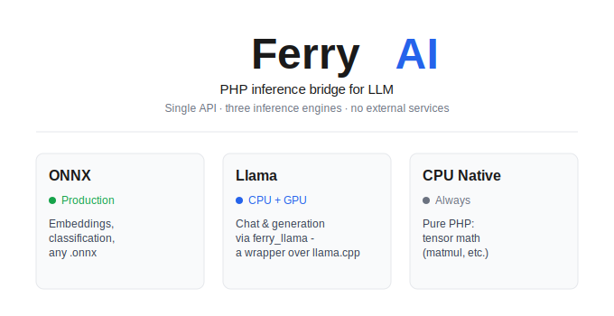

<p align="center">
  
</p>

# FerryAI — native AI inference for PHP

**Run ONNX, GGUF, and RubixML models directly in PHP — no Python, no HTTP microservices, no Docker sidecars.**
One API, full FFI bridge to native engines. Inference-only. PHP 8.3+.

[](https://github.com/MADEVAL/FerryAI/actions/workflows/ci.yml)
[](https://github.com/MADEVAL/FerryAI/tags)
[](https://www.php.net/)
[](https://github.com/MADEVAL/FerryAI/actions/workflows/ci.yml)
[](LICENSE.md)
[](phpstan.neon)
[](psalm.xml)

> **Status: early release (`v0.1.0`).** The public API is stabilizing and may change before `1.0` —
> pin a version and skim the [CHANGELOG](CHANGELOG.md) when upgrading. Code quality is production-grade
> (PHPStan level 8, Psalm level 3, 793 tests green on Windows + Linux).

## Contents

- [Quick example](#quick-example)
- [Why FerryAI](#why-ferryai)
- [Backends](#backends)
- [Vector store](#vector-store)
- [Observability & model pool](#observability--model-pool)
- [Install](#install)
- [Dependencies](#dependencies)
- [Capabilities](#capabilities)
- [Packages](#packages)
- [Testing](#testing)
- [Examples](#examples)
- [Documentation](#documentation)
- [Contributing & license](#contributing--license)

---

## Quick example

**Embeddings & vector search** — semantic RAG in 8 lines:

```php
use FerryAI\AI;

AI::config([
    'backend' => 'onnx',
    'backends' => ['embedding' => ['model_path' => '/models/all-MiniLM-L6-v2-onnx']],
]);

// embed → 384d vector, then store and search
$vec = AI::embed('Hello world');
$store = AI::vector('docs');
$store->add('doc1', $vec->vector, ['title' => 'Getting Started']);
$hits = $store->search(AI::embed('semantic query')->vector, k: 5);

// similarity between any two texts
echo AI::similarity('cat', 'kitten');   // 0.79

// compose a processing pipeline
$results = AI::pipeline()
    ->pipe(new TransformStage(strtoupper(...)))
    ->pipe(new FilterStage(fn($x) => strlen($x) > 3))
    ->run(['hi', 'hello', 'hey']);
```

**Chat & streaming** — local LLM in 3 lines:

```php
AI::config(['backend' => 'llama', 'backends' => ['llama' => ['model_path' => '/models/qwen.gguf']]]);

echo AI::chat('Explain PHP FFI in one sentence.');        // full reply
foreach (AI::stream('Write a haiku about ferries.') as $token) { echo $token; }

// structured output via JSON Schema → GBNF grammar
$json = AI::chat('List 3 famous bridges with year and city.', [
    'grammar' => [
        'type' => 'object',
        'properties' => ['bridges' => [
            'type' => 'array',
            'items' => ['type' => 'object', 'properties' => [
                'name' => ['type' => 'string'],
                'year' => ['type' => 'integer'],
                'city' => ['type' => 'string'],
            ]],
        ]],
    ],
]);

// HTTP streaming response (PSR-7 SSE/NDJSON) for web apps
return AI::streamResponse([['role' => 'user', 'content' => $prompt]]);
```

---

## Why FerryAI

| | FerryAI | Python sidecar |
|---|---|---|
| Deployment | One PHP process. `composer require` | Python runtime + HTTP server + process manager |
| Latency | Zero-copy FFI → sub-ms overhead | HTTP round-trip per inference |
| Memory | Shared weights across workers (shmop) | Duplicated per process |
| Debugging | PHP stack traces, xdebug | Cross-process tracing |
| Structured output | JSON Schema → GBNF grammar, guaranteed valid JSON | Prompt engineering + regex hacks |
| Model cache | Built-in HuggingFace download + LRU cache + SHA-256 verify | Manual pip + custom scripts |
| Type safety | PHPStan level 8 + Psalm level 3 | mypy (optional) |
| Streaming | Native PHP Generator + SSE/NDJSON PSR-7 response | Flask/FastAPI streaming boilerplate |

FerryAI loads native shared libraries (`onnxruntime.dll`, `llama.dll`) directly via PHP FFI —
the same C APIs that Python uses. No subprocess, no `shell_exec`, no Python. Tokenizers, vector
search and tensor math all run in pure PHP when native equivalents are unavailable.

---

## Backends

| Backend | Drives | Highlights |
|---------|--------|-----------|
| **ONNX Runtime** | `embed()` `similarity()` `classify()` `moderate()` | Any `.onnx` model. CPU + CUDA/ROCm/DirectML/OpenVINO GPU. Auto-fallback to CPU when GPU deps are missing. All-MiniLM-L6-v2 → 384d vectors. |
| **llama.cpp** | `chat()` `stream()` `streamResponse()` | Real LLM chat & token-by-token streaming. Runs on CPU and CUDA GPU (Windows + Linux). Samplers: greedy, top-k, top-p, **GBNF grammar**. JSON Schema → GBNF for guaranteed structured output. ChatFormatter with 5 message templates. |
| **CPU Native** | `predict()` + tensor ops | Pure-PHP tensor math (matmul, transpose, reshape, slice). Optional RubixML `.rbm` tabular inference. Always available, no native deps. |

### LLM in detail

| Path | Support |
|------|---------|
| `AI::chat()` / `AI::stream()` (CPU) | ✅ real chat via `LlamaBackend` + `ferry_llama` wrapper, Windows and Linux |
| `AI::chat()` / `AI::stream()` (GPU, CUDA) | ✅ layer offload via `GGML_CUDA=ON` build |
| Safetensors→GGUF models (e.g. Qwen3-0.6B) | ✅ one-time `convert_hf_to_gguf.py`, then native inference |
| ONNX embeddings (GPU, CUDA) | ✅ CUDA provider auto-detected, silent CPU fallback |

```php
AI::config([
    'backend'  => 'llama',
    'device'   => 'cuda',   // or 'cpu'
    'backends' => ['llama' => ['model_path' => '/models/model.gguf', 'n_gpu_layers' => 35]],
]);

echo AI::chat('Summarize FFI in PHP.');
```

Configure the wrapper via `FERRY_AI_LLAMA_WRAPPER` (or `FERRY_AI_LLAMA_LIB`), add that dir to
`PATH`. Sampling is per-request: `temperature: 0` → greedy, `> 0` → top-p; force one with
`['sampler' => 'top_k']` or supply a `['grammar' => '<gbnf>']` / JSON Schema.
Build steps: [`docs/DOCUMENTATION.md`](docs/DOCUMENTATION.md) ·
[native/llama-wrapper/README.md](native/llama-wrapper/README.md).
Run: [`examples/03-chat.php`](examples/03-chat.php) ·
[`examples/04-streaming.php`](examples/04-streaming.php) ·
[`examples/09-grammar.php`](examples/09-grammar.php).

---

## Vector store

Two interchangeable backends behind the same `VectorStore` contract — pick per environment:

| Backend | Search | Best for |
|---------|--------|----------|
| **SQLite** | Brute-force, or native KNN via **sqlite-vec** (vec0 ANN) when available | Dev, demos, embedded, single-file |
| **PostgreSQL + pgvector** | Native `<=>` / `<->` / `<#>`, HNSW / IVFFlat indexes | Production, large collections, concurrency |

```php
AI::config(['vector' => [
    'driver' => 'pgsql',                                     // or omit for SQLite
    'dsn' => 'pgsql:host=127.0.0.1;port=5432',
    'user' => 'postgres', 'password' => 'postgres',
]]);

$store = AI::vector('docs');
$store->add('doc1', $vec->vector, ['lang' => 'en']);
$hits = $store->search($query, k: 5, filter: ['lang' => ['eq' => 'en']]);
```

SQLite transparently uses **sqlite-vec** (vec0 virtual tables) for native KNN on PHP 8.4+,
and falls back to pure-PHP brute-force otherwise — filters always work.
[`examples/21-postgres-vector.php`](examples/21-postgres-vector.php) ·
[`examples/23-sqlite-vec.php`](examples/23-sqlite-vec.php).

---

## Observability & model pool

Instrumentation lives at the facade layer (backends stay isolated). **Off by default** —
zero overhead when disabled:

```php
AI::config(['observability' => ['metrics' => true, 'profiling' => true, 'logging' => true]]);

AI::embed('hello');                 // automatically timed, counted and logged
print_r(FerryAI\Metrics::report()); // counters + timing histograms per operation
print_r(FerryAI\Profiler::report());// per-operation count / avg / min / max ms
```

`AI::warmup([...])` preloads models into a memory-bounded LRU `ModelPool`;
`classify()` / `moderate()` / `predict()` / `chat()` reuse pooled instances.
Opt into cross-worker weight sharing via `ext-shmop`. Downloads retry transient failures.
[`examples/22-observability.php`](examples/22-observability.php).

---

## Install

```bash
composer require ferry-ai/php-inference
```

Base requirements: **PHP 8.3+**, `ext-ffi`, `ext-json`, `ext-hash`, `ext-fileinfo`.

**After install — run the diagnostic** to see what's available:

```bash
vendor/bin/ferry-ai check              # PHP, extensions, backends, cache — full report
vendor/bin/ferry-ai check --json       # machine-readable

# Download models from HuggingFace and start using them immediately
vendor/bin/ferry-ai models:download sentence-transformers/all-MiniLM-L6-v2
vendor/bin/ferry-ai chat "Explain FFI in one sentence."
vendor/bin/ferry-ai chat "Hello" --stream --max=100
```

Everything else is **optional and on-demand** — install only what a feature needs.
FerryAI degrades gracefully (pure-PHP fallback or a clear "not available" message) when a
native library or model is missing.

---

## Dependencies

What you need for each capability. Full source list with versions: [`docs/SOURCES.md`](docs/SOURCES.md).

| Capability | PHP side | Native artifact | Config |
|-----------|----------|-----------------|--------|
| ONNX (embeddings, classification) | `ext-ffi` | ONNX Runtime lib | `FERRY_AI_MODEL_DIR` or `backends.embedding.model_path` |
| LLM chat / streaming | `ext-ffi` | llama.cpp + `ferry_llama` wrapper | `FERRY_AI_LLAMA_DIR` / `FERRY_AI_LLAMA_LIB` |
| GPU (ONNX CUDA / llama.cpp) | — | CUDA Toolkit + cuDNN for ONNX | `device: 'cuda'` + GPU-enabled build |
| Vector store (SQLite) | `ext-pdo_sqlite` (bundled) | — | works out of the box |
| Vector ANN (sqlite-vec) | `ext-pdo_sqlite` | `vec0.{dll,so,dylib}` | `FERRY_AI_VEC_EXTENSION_LIB` |
| Vector store (PostgreSQL) | `ext-pdo_pgsql` | PostgreSQL + pgvector | `FERRY_AI_VECTOR_DRIVER=pgsql` |
| Model Hub / HuggingFace | `ext-curl`, `ext-zip`, `ext-sodium` | — | `FERRY_AI_MODEL_CACHE` |
| CPU tabular ML (RubixML) | `rubix/ml` (isolated) | `.rbm` estimator | `FERRY_AI_RUBIXML_AUTOLOAD` |
| Native tokenizer (optional) | `ext-ffi` | tokenizers-cpp lib | `FERRY_AI_TOKENIZERS_LIB` |
| Shared weights (workers) | `ext-shmop` | — | `model_pool.shared_memory=true` |

GPU setup guide (CUDA/cuDNN/curand/cufft + llama.cpp build):
[`docs/DOCUMENTATION.md`](docs/DOCUMENTATION.md) → *Quick Start → GPU setup*.
GPU→CPU fallback is automatic and silent.

---

## Capabilities

### Inference

| Capability | Description |
|-----------|-------------|
| `AI::embed()` / `AI::similarity()` | Text → vector, cosine similarity. 4 pooling strategies (mean, cls, eos, max). Batch embedding. |
| `AI::chat()` / `AI::stream()` | LLM chat & token-by-token streaming. Samplers: greedy, top-k, top-p, GBNF grammar. |
| `AI::streamResponse()` | PSR-7 SSE/NDJSON streaming HTTP response for web apps. |
| `AI::classify()` | Run classification `.onnx` models (or CPU-native fallback). |
| `AI::moderate()` | Content moderation with per-category scores and a `flagged` boolean. |
| `AI::predict()` | CPU-native tabular prediction via pure-PHP tensor ops or RubixML `.rbm` models. |

### Structured generation

| Capability | Description |
|-----------|-------------|
| GBNF grammar | Constrain LLM output to a formal grammar. Guaranteed valid JSON, enum values, DSLs. |
| JSON Schema → GBNF | Pass a JSON Schema object as `grammar` — auto-converted to GBNF. No prompt engineering needed. |

### Vector store

| Capability | Description |
|-----------|-------------|
| SQLite store | CRUD, brute-force KNN, metadata filtering. Optional sqlite-vec (vec0) native ANN. |
| PostgreSQL + pgvector | Native `<=>` / `<->` / `<#>`, HNSW/IVFFlat indexes. Metadata filtering. |
| `AI::pipeline()` | Composable Generator-based pipeline with 8 built-in stages: chunk, tokenize, embed, classify, normalize, filter, store, transform. |

### Model management

| Capability | Description |
|-----------|-------------|
| Model Hub | Download from HuggingFace with progress. SHA-256 + Ed25519 signature verification. LRU cache with size limits. |
| Model pool | Memory-bounded LRU eviction. Opt-in cross-worker weight sharing via `ext-shmop`. |
| `AI::warmup()` | Preload models into the pool so first inference is instant. |
| Auto GPU→CPU fallback | ONNX silently retries on CPU when GPU providers are missing (incomplete CUDA installs). |

### Concurrency

| Capability | Description |
|-----------|-------------|
| FiberPipeline | Pipeline with cooperative concurrency and wall-clock timeout support. |
| AsyncInference | `runAsync()` / `runParallel()` — run multiple inferences concurrently via PHP Fibers. |

### Developer experience

| Capability | Description |
|-----------|-------------|
| `ferry-ai check` | Full environment diagnostic: PHP, extensions, backends, cache — with `--json` mode. |
| `ferry-ai models:download` / `chat` | CLI model management and single-turn chat. |
| Pure-PHP tokenizers | BPE and WordPiece tokenizers with zero native dependencies. |
| Pure-PHP tensor math | matmul, transpose, reshape, slice — always available. |
| Framework adapters | Thin Laravel ServiceProvider and Symfony Bundle included. |

### Platform

| | |
|---|---|
| **Windows** | ✅ Unit + integration (ONNX, llama.cpp, SQLite, PostgreSQL) |
| **Linux** | ✅ Unit + integration (all backends including CUDA) |
| **macOS** | ✅ Supported (CI-targeted, not yet in active integration matrix) |

---

## Packages

```
packages/
├── core/          Contracts, enums, value objects, exceptions, AIConfig
├── tensor/        ArrayTensor (pure PHP), BackedTensor, TensorFactory
├── onnx-backend/  ONNX Runtime via ankane/onnxruntime FFI
├── llama-backend/ llama.cpp FFI, samplers (greedy/top-k/top-p/grammar),
│                  GBNF grammar, JSON Schema→GBNF, ChatFormatter (5 templates)
├── tokenizer/     Pure PHP BPE + WordPiece (round-tripping, chunking)
├── embedding/     Mean/CLS/EOS/Max pooling, 4 built-in models
├── vector/        SQLite + PostgreSQL/pgvector store, brute-force & native ANN, metadata filtering
├── model-hub/     HF download, LRU cache, SHA-256+Ed25519, format detection
├── pipeline/      Generator-based stages (8 types)
├── cpu-backend/   Pure-PHP tensor math + optional RubixML (.rbm) tabular inference
├── dataframe/     Tabular data: typed columns, CSV/JSON I/O, Tensor conversion
├── ai/            Facade (AI::), backend registry, model pool, metrics, profiler
├── laravel/       Service provider + facade (env-based config)
└── symfony/       Bundle + DI extension
```

---

## Testing

```bash
composer test                # Unit tests — 793 pure-PHP tests
composer test-integration    # Integration — needs ONNX Runtime / llama.cpp / PostgreSQL
composer check               # Lint (CS + PHPStan lvl8 + Psalm lvl3) + unit tests — gate
```

---

## Examples

[`examples/`](examples/) — 26 standalone scripts covering every capability:
embedding, tokenizer, chat, streaming, RAG, pipeline, SQLite + sqlite-vec &
PostgreSQL/pgvector, grammar-constrained generation, model hub, profiling, async fibers,
model pool, observability, retry, CPU tensor math + RubixML, benchmarks, Laravel, Symfony.

```bash
set FERRY_AI_MODEL_DIR=C:\models\all-MiniLM-L6-v2-onnx
php examples/01-hello-embedding.php
```

---

## Documentation

Start here: **[`docs/DOCUMENTATION.md`](docs/DOCUMENTATION.md)** — definitive single-file reference
(architecture, facade API, contracts, GPU setup).

Guides: [getting-started](docs/getting-started.md) ·
[configuration](docs/configuration.md) ·
[ONNX](docs/backends/onnx.md) / [llama.cpp](docs/backends/llama.md) ·
[embedding](docs/embedding.md) · [vector store](docs/vector-store.md) ·
[pipeline](docs/pipeline.md) · [model hub](docs/model-hub.md) ·
[safetensors → GGUF](docs/safetensors-conversion.md) ·
[tokenizer](docs/tokenizer.md) · [streaming](docs/streaming.md) ·
[security](docs/security.md) · [deployment](docs/deployment.md) ·
[Laravel](docs/laravel.md) / [Symfony](docs/symfony.md) ·
[troubleshooting](docs/troubleshooting.md) · [API reference](docs/api-reference.md) ·
[CHANGELOG](CHANGELOG.md)

| Document | Purpose |
|----------|---------|
| [`docs/TECHNICAL_SPECIFICATION.md`](docs/TECHNICAL_SPECIFICATION.md) | Architecture |
| [`docs/FILE_TREE.md`](docs/FILE_TREE.md) | Complete file map |
| [`docs/INTERFACE_CONTRACTS.md`](docs/INTERFACE_CONTRACTS.md) | Interface signatures |
| [`docs/SOURCES.md`](docs/SOURCES.md) | External stack reference |
| [`docs/README.md`](docs/README.md) | Full navigator |

---

## Contributing & license

- **Contributing:** guidelines and workflow in [`.github/CONTRIBUTING.md`](.github/CONTRIBUTING.md).
- **Security:** report vulnerabilities via [`.github/SECURITY.md`](.github/SECURITY.md) — please do not open public issues for them.
- **Code of Conduct:** [`.github/CODE_OF_CONDUCT.md`](.github/CODE_OF_CONDUCT.md).
- **License:** MIT — see [LICENSE.md](LICENSE.md).
